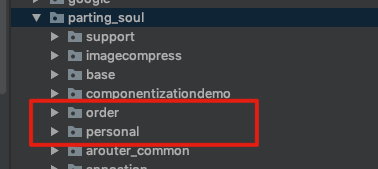

[TOC]

### 一. 概述

组件化： 把项目按照业务拆分成若干个组件，每个业务组件可以单独编译运行，组件化后所有业务组件的地位都是一样的。

集成化传统项目：整个工程只有app模块可以单独运行，其他module作为app的子模块

组件化产生的背景：

- 传统项目在调试一个小功能时整个项目都要进行编译运行，项目庞大时，编译速度十分漫长
- 在团队协作方面可能会造成代码冲突
- 随着项目变得庞大，不容易让别人接手

优点：

- 各个组件之间的耦合度低，若某个业务组件的功能被废弃，可以修改很少代码砍掉该功能
- 每个业务组件都可以单独运行，降低了项目编译运行的时间
- 每一个开发人员可以负责一个业务组件的开发，多人协作更加方便

### 二. 组件化项目部署

例如现在有个人中心和订单两个业务组件，app为壳工程，base为基础组件。

#### 2.1 全局版本管理

由于将工程划分为了多个组件，为了避免在项目合并打包时，由于依赖库或者SDK版本不一致产生的问题，需要进行全局的版本管理。

在工程的根目录下创建一个config.gradle文件。该文件中声明了SDK、公共依赖库的一些版本信息以及组件化模式的开关字段。

config.gradle

```groovy
ext {

    // false: 组件化模式，每一个组件可以独立运行；true: 集成化模式，整个项目打包成一个apk，模块不能单独运行
    isRelease = true

    appVersion = [
            "compileSdkVersion": 29,
            "buildToolsVersion": "29.0.1",
            "minSdkVersion"    : 19,
            "targetSdkVersion" : 29,
    ]

    def butterKnifeVersion = "10.1.0"
    def glideVersion = "4.9.0"

    dependencies = [
            "appcompat"                    : "androidx.appcompat:appcompat:1.0.2",
            "constraintlayout"             : "androidx.constraintlayout:constraintlayout:1.1.3",
            "butterknife"                  : "com.jakewharton:butterknife:${butterKnifeVersion}",
            "recyclerview"                 : "androidx.recyclerview:recyclerview:1.0.0",
            "cardview"                     : "androidx.cardview:cardview:1.0.0",
            "swipebacklayout"              : "me.imid.swipebacklayout.lib:library:1.1.0",

            "rxjava2"                      : "io.reactivex.rxjava2:rxjava:2.2.8",
            "rxandroid"                    : "io.reactivex.rxjava2:rxandroid:2.1.0",
            "retrofit2-rxjava2-adapter"    : "com.jakewharton.retrofit:retrofit2-rxjava2-adapter:1.0.0",
            "logging-intercepto"           : "com.squareup.okhttp3:logging-interceptor:3.10.0",
            "retrofit"                     : "com.squareup.retrofit2:retrofit:2.5.0",
            "converter-gson"               : "com.squareup.retrofit2:converter-gson:2.4.0",
            "BaseRecyclerViewAdapterHelper": "com.github.CymChad:BaseRecyclerViewAdapterHelper:2.9.45",
            "spanny"                       : "com.binaryfork:spanny:1.0.4",
            "roundedimageview"             : "com.makeramen:roundedimageview:2.3.0",
            "eventbus"                     : "org.greenrobot:eventbus:3.1.1",
            "SmartRefreshLayout"           : "com.scwang.smartrefresh:SmartRefreshLayout:1.1.0-andx-5",
            "glide"                        : "com.github.bumptech.glide:glide:${glideVersion}",
            "FlycoTabLayout_Lib"           : "com.flyco.tablayout:FlycoTabLayout_Lib:2.1.2@aar",
            "rxpermissions"                : "com.github.tbruyelle:rxpermissions:0.10.2",
            "multidex"                     : "androidx.multidex:multidex:2.0.0",
            "imageCompress"                : "com.parting_soul.imagecompress:imageCompress:1.0.2",
            "banner"                       : "com.youth.banner:banner:1.4.10",
            "ExpandableTextView"           : "cn.carbs.android:ExpandableTextView:1.0.3"
    ]

    annotationProcessor = [
            "butterknife": "com.jakewharton:butterknife-compiler:${butterKnifeVersion}",
            "glide"      : "com.github.bumptech.glide:compiler:${glideVersion}"
    ]
}
```

定义完之后，我们需要在项目中引用该配置文件，打开项目的根build.gradle，在该文件中引入config.gradle

```groovy
// 引入配置文件
apply from: "config.gradle"
buildscript {
    repositories {
        google()
        jcenter()

    }
    dependencies {
        classpath 'com.android.tools.build:gradle:3.4.1'

        // NOTE: Do not place your application dependencies here; they belong
        // in the individual module build.gradle files
    }
}

allprojects {
    repositories {
        google()
        jcenter()
        maven { url "https://jitpack.io" }
    }
}

task clean(type: Delete) {
    delete rootProject.buildDir
}

```

将配置文件引入之后，就可以在各个子module中使用配置文件中定义的变量了。例如在app的build.gradle文件。

```groovy
apply plugin: 'com.android.application'

def appVersion = rootProject.ext.appVersion
def supportDependencies = rootProject.ext.dependencies
def supportAnnotationProcessor = rootProject.ext.annotationProcessor

android {
    compileSdkVersion appVersion.compileSdkVersion
    buildToolsVersion appVersion.buildToolsVersion
    defaultConfig {
        applicationId "com.parting_soul.componentizationdemo"
        minSdkVersion appVersion.minSdkVersion
        targetSdkVersion appVersion.targetSdkVersion
        versionCode 1
        versionName "1.0"
        testInstrumentationRunner "androidx.test.runner.AndroidJUnitRunner"
    }
    buildTypes {
        release {
            minifyEnabled false
            proguardFiles getDefaultProguardFile('proguard-android-optimize.txt'), 'proguard-rules.pro'
        }
    }

    compileOptions {
        sourceCompatibility JavaVersion.VERSION_1_8
        targetCompatibility JavaVersion.VERSION_1_8
    }
}

dependencies {
    implementation fileTree(dir: 'libs', include: ['*.jar'])

    supportDependencies.each {
        k, v -> implementation v
    }

    supportAnnotationProcessor.each {
        k, v -> annotationProcessor v
    }

    implementation project(path: ':base')
    if (isRelease) {
        implementation project(":order")
        implementation project(":personal")
    }

}
```

可以看到项目使用的SDK版本以及依赖库的版本都使用了我们在config,gradle定义的版本。在dependencies闭包中，引入了了三个module: base基础组件以及订单和个人中心业务组件。这边要进行一下判断，若当前是以组件化模式运行，则app中不引入两个业务组件，因为此时两个业务组件是可以单独运行的；若当前是以集成化模式运行，则以module的方式引入两个组件，而此时业务组件不可独立运行。

配置完app的build.gradle，然后需要配置对应的业务组件的build.gradle，以订单组件的build.gradle为例。

```groovy
if (isRelease) {
    //集成化模式
    apply plugin: 'com.android.library'
} else {
    apply plugin: 'com.android.application'
}


def appVersion = rootProject.ext.appVersion
def supportDependencies = rootProject.ext.dependencies
def supportAnnotationProcessor = rootProject.ext.annotationProcessor

android {
    compileSdkVersion appVersion.compileSdkVersion
    buildToolsVersion appVersion.buildToolsVersion


    defaultConfig {
        if (!isRelease) {
            applicationId "com.parting_soul.order"
        }
        minSdkVersion appVersion.minSdkVersion
        targetSdkVersion appVersion.targetSdkVersion
        versionCode 1
        versionName "1.0"

        testInstrumentationRunner "androidx.test.runner.AndroidJUnitRunner"

    }

    buildTypes {
        release {
            minifyEnabled false
            proguardFiles getDefaultProguardFile('proguard-android-optimize.txt'), 'proguard-rules.pro'
        }
    }

    compileOptions {
        sourceCompatibility JavaVersion.VERSION_1_8
        targetCompatibility JavaVersion.VERSION_1_8
    }

    sourceSets {
        main {
            if (!isRelease) {
                //组件化模式
                manifest.srcFile 'src/debug/AndroidManifest.xml'
            } else {
                //集成模式
                manifest.srcFile 'src/main/AndroidManifest.xml'
                java.srcDirs 'src/main/java/com/parting_soul/order'
                java {
                    //不打包debug目录下的java文件
                    exclude '**/debug/**'
                }
            }
        }
    }

}

dependencies {
    implementation fileTree(dir: 'libs', include: ['*.jar'])
    implementation project(path: ':base')
    supportDependencies.each {
        k, v -> implementation v
    }

    supportAnnotationProcessor.each {
        k, v -> annotationProcessor v
    }
}
```

从上可以看出，订单组件同样依赖base基础组件。当以组件化模式运行时，当前module可以单独运行，此时该组件存在自己的applicationId；而以集成化模式运行时，当前module不可单独运行，以library的方式引入app中，此时不存在applicationId。

#### 2.2 移除不必要的调试代码

当使用组件化时，每一个业务组件都可以单独运行，所以可能会产生许多容易的调试代码，若不做任何处理，这些调试代码同样会打包到最终的apk中，会增大apk的包体积。因此，当我们以集成化模式打包的时候，需要将这些调试的代码从组件中排除。

```groovy
android {
      sourceSets {
        main {
            if (!isRelease) {
                //组件化模式
                manifest.srcFile 'src/debug/AndroidManifest.xml'
            } else {
                //集成模式
                manifest.srcFile 'src/main/AndroidManifest.xml'
                java {
                    //不打包debug目录下的java文件
                    exclude '**/debug/**'
                }
            }
        }
    }
}
```

### 三. 路由

组件化将各个业务拆分成了不同的组件，各个业务组件之间的耦合度几乎不存在，那么这些业务组件之间要如何进行通信，例如个人中心组件中可以跳转到订单组件的某个界面，此时要通过何种方式实现，此时路由的概念就这样被引出来了。

#### 1. 类加载方式

界面跳转通过Intent实现，个人中心跳转到订单界面，正常的写法如下：

```java
Intent intent = new Intent(this, Order_MainActivity.class);
startActivity(intent);
```

但是由于订单组件和个人中心组件完成不耦合，也就是在订单界面中找不到Order_MainActivity这个类，但是应用在集成化模式成apk时，所有组件的class都会被打包进apk。



也就是说虽然在personal组件中找不到Order_MainActivity这个类，但是打包后personal组件和order组件同属于整个app，也就是它们的class文件都存在apk中，此时我们可以通过类加载机制实现界面的跳转。

```java
try {
    Class<?> clazz = Class.forName("com.parting_soul.order.Order_MainActivity");
    Intent intent = new Intent(this, clazz);
    startActivity(intent);
} catch (ClassNotFoundException e) {
    e.printStackTrace();
}
```

通过类加载的方式的确可以实现不同组件间界面的跳转，但是这种方式不够灵活，需要知道目的Activity的全类名，一旦类名或者路径发生变更，使用的地方同样需要改变。

#### 2. 使用全局Map存储路径关系

组件化过程中，所有的业务组件都需要依赖基础组件，我们可以将路径关系存放在基础组件中，然后各个业务组件都可以依靠基础组件去跳转到其他业务组件的界面。

首先要有一个路径对象，来记录一个类的路径和Class信息

```java
/**
 * 路径
 *
 * @author parting_soul
 * @date 2019-11-19
 */
public class PathBean {
    private String path;
    private Class<?> targetClass;

    public PathBean(String path, Class<?> targetClass) {
        this.path = path;
        this.targetClass = targetClass;
    }

    public String getPath() {
        return path;
    }

    public void setPath(String path) {
        this.path = path;
    }

    public void setTargetClass(Class<?> targetClass) {
        this.targetClass = targetClass;
    }

    public Class<?> getTargetClass() {
        return targetClass;
    }
}
```

一个项目可能会有多个业务组件，为了便于归类，每一个组件内的所有路径可视为一组，因此有如下的映射关系，其中key为所在组，value为组内所有的路径信息。

```java
private Map<String, List<PathBean>> mPathMap = new HashMap<>();
```

整个路径管理类

```java
public class RecordManager {
    private static RecordManager sRecordManager;

    private Map<String, List<PathBean>> mPathMap = new HashMap<>();

    private RecordManager() {
    }

    public static RecordManager getInstance() {
        if (sRecordManager == null) {
            synchronized (RecordManager.class) {
                if (sRecordManager == null) {
                    sRecordManager = new RecordManager();
                }
            }
        }
        return sRecordManager;
    }

    /**
     * 添加路径信息
     *
     * @param group       所在组
     * @param path        路径
     * @param targetClass 对应的Class
     */
    public void addPath(String group, String path, Class<?> targetClass) {
        List<PathBean> pathBeans = mPathMap.get(group);
        if (pathBeans == null) {
            //组不存在，则创建组并且加入
            pathBeans = new ArrayList<>();
            pathBeans.add(new PathBean(path, targetClass));
            mPathMap.put(group, pathBeans);
        } else {
            Class<?> clazz = getTargetClass(group, path);
            if (clazz == null) {
                //组中不存在该路径，则加入该路径
                pathBeans.add(new PathBean(path, targetClass));
            }
        }
    }

    /**
     * 根据组合路径获取目标Class
     *
     * @param group
     * @param path
     * @return
     */
    public Class<?> getTargetClass(String group, String path) {
        List<PathBean> pathBeans = mPathMap.get(group);
        Class<?> clazz = null;
        if (pathBeans != null) {
            for (PathBean p : pathBeans) {
                if (p.getPath().equalsIgnoreCase(path)) {
                    clazz = p.getTargetClass();
                    break;
                }
            }
        }
        return clazz;
    }
}
```

全局路径管理类已经创建好了，然后需要在合适的地方将路径加入到该管理类中。

```java
public class App extends Application {
    @Override
    public void onCreate() {
        super.onCreate();
        RecordManager.getInstance().addPath("order", "Order_MainActivity", Order_MainActivity.class);
        RecordManager.getInstance().addPath("personal", "Personal_MainActivity", Personal_MainActivity.class);
        RecordManager.getInstance().addPath("app", "MainActivity", MainActivity.class);
    }

}
```


